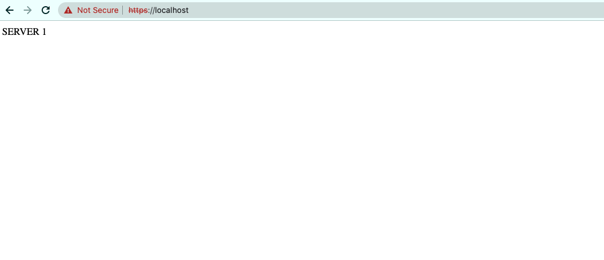
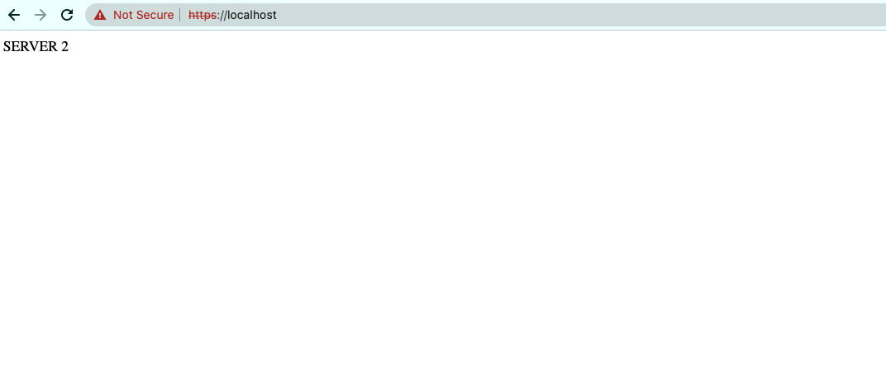

# Technologies
- Docker
- Nginx (LoadBalancer)
- Alpine (Lightweight linux distro)
- PHP-FPM (Separate php from server for fast access)

# Things in here
- Round robin algorithm (LoadBalancer)
- SSL

# How to use
1. Generate local CRT certificate
```cmd
openssl req -x509 -newkey rsa:4096 -keyout key.pem -out cert.pem -sha256 -days 365 -subj '/CN={passphrase-here}'
```
2. Store cert.pem, key.pem into `conf.d/cert` folder.
3. Store your `passphrase` into `conf.d/cert/ssl.pass` file
4. Run `make up`
5. Access `localhost`

# Images



## References
[Reference](https://kipalog.com/posts/Su-dung-NGINX-nhu-mot-Load-Balancer)